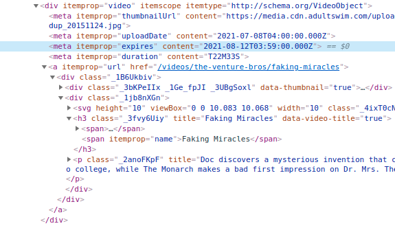

# [adultswim] Expiration Notices
___This [Tampermonkey](https://tampermonkey.net) script adds expiration dates to most of the video thumbnails posted to [adultswim.com](https://adultswim.com).___

&nbsp;

While the [adultswim] website often shows the expiration dates in the description area of individual episode pages, it does not display them on thumbnails such as those found on the overall show listing pages.  This metadata is usually include in the page DOM, though.  This script simply looks for these hidden timestamps and adds a tag above the episode title.

&nbsp;

  
*An example of the labels added to an [adultswim] listing by this script with color-coding by closeness of expiration date*

&nbsp;

  
*Example tags for a video thumbnail on the [adultswim] website showing the hidden expiration metadata*

&nbsp;

---

## Installation

This script can be installed easily by first adding the [Tampermonkey](https://tampermonkey.net) addon to a web browser and then visiting this direct link to the script file:

[https://github.com/thompsoc81/adultswim-expiration/raw/main/adultswim-expiration.user.js](https://github.com/thompsoc81/adultswim-expiration/raw/main/adultswim-expiration.user.js)

The Tampermonkey extension should intercept the link opening and ask if it can install the script.  If it does not do this, open the extension's Dashboard page and add this script manually.  That's it!  It should now run on any URL visited that matches http[s]://*.adultswim.com/videos/*

While this script was designed and tested with Tampermonkey in Chrome, it may work (or with only slight modification) within the original user script extension, [Greasemonkey](https://greasespot.net).  This has not been tested, but this script is not complex nor using any arcane features.  It likely is compatible.

&nbsp;

---

## Color-Coding

Rather than show all expiration times identically, this script attempts to convey the urgency by increasing the size and altering the color of the inserted date label.  If the expiration is more than a month away, the text will be smaller with no highlight color.  If the date is between a week and a month away, it will be highlighted in green.  If it is 3-7 days, it will be yellow.  1-3 days will be orange.  24 hours or less will be red.

```javascript
    // the cutoff values for the color warnings
    let red_days = 1;
    let orange_days = 3;
    let yellow_days = 7;
    let green_days = 31;
```

Each increase in "urgency" will also slightly increase the label text size.

```javascript
    let expBgColor = null;
    let expFgColor = null;
    let textScale = "60%";
    
    if (days <= red_days) {
        expBgColor = "lightpink";
        expFgColor = "crimson";
        textScale = "90%";
    }
    else if (days <= orange_days) {
        expBgColor = "peachpuff";
        expFgColor = "coral";
        textScale = "85%";
    }
    else if (days <= yellow_days) {
        expBgColor = "lightgoldenrodyellow";
        expFgColor = "darkgoldenrod";
        textScale = "75%";
    }
    else if (days <= green_days) {
        expBgColor = "lightseagreen";
        expFgColor = "darkgreen";
        textScale = "70%";
    }
```

*(Due to time zone calculation issues explained below, treat this like just a "good enough" approximation.  It is not guaranteed for total accuracy.)*

&nbsp;

---

## Notes and Caveats

### Inconsistency (from the server)
The expiration data is not always present on all [adultswim] video thumbnails.  Some series do not have the data specified.  For series that _usually_ have expiration data, it sometimes is just not present.  The server, for whatever reason, will fail to insert it into the page even though you know you've seen it for that show previously.  When this happens, the page can be reloaded a few times until it appears, but it might also be necessary to just wait until the server starts inserting the expiration data once more.

### Spotting the patterns
After using a script like this for a while, it's easy to spot the pattern that most shows on the [adultswim] website follow for adding and removing episodes.  Most shows will either:

* post entire seasons or blocks of episodes for long periods of time, expire them all at same time, and replace them with the next block of episodes.
* post one new episode each week and expire one episode each week on the same day of the week, often with a block of 4-8 episodes available in-between them, sweeping across one season, for each season simultaneously, or working through the season in sequence.
* many shows do not have a practical expiration but will still have date set for the year 2036 (though this seems less common after they started moving content to HBO MAX &ndash; a higher percentage of what remains on the site is no longer simply static for years).

If you are trying to find a particular episode of a show, it's not hard once spotting its pattern to guess at how many weeks you may need to wait for it to be posted on their site.  This is true of both episodes that are open to all and locked behind a TV provider login.  Often an entire seaon will be available behind the provider login and a block of a few unlocked episodes will sweep through the show listing following one of these patterns.

Most of the shows will expire or be added around midnight Eastern USA time (probably because [adultswim] is based from Atlanta, GA), but this is not always the case.  Hovering over the expiration label added by this script will show a tooltip with the raw timestamp value that was hidden in the page.  Which leads into the next issue...

### Time zones
All the expiration dates from the server are listed in UTC, and this script does not convert them to local time (but that's a good idea for the next version!).  This could lead to the dates being slightly off from your local perspective.  Again, hover over the label to see the full timestamp with the actual time of day if something doesn't seem quite right.

Also note that UTC time does not change with daylight savings, so it will not be the same offset year-round for most people:  [https://www.timeanddate.com/time/zone/usa](https://www.timeanddate.com/time/zone/usa)

&nbsp;

---

&nbsp;

### *Enjoy!*
